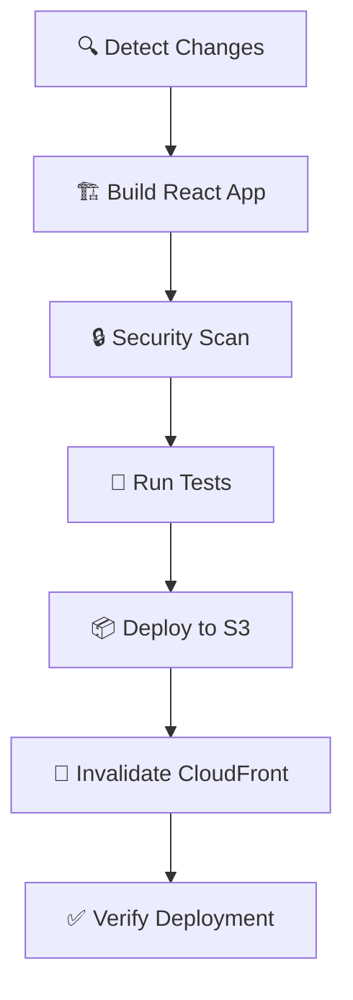
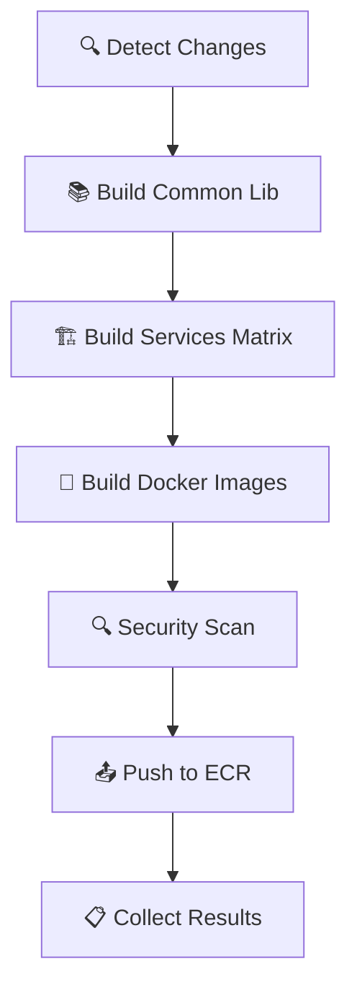

# =================================
# DOCUMENTATION PIPELINES CI/CD
# =================================

## 🎯 Vue d'ensemble

Deux pipelines GitHub Actions ont été créés pour automatiser le build et déploiement de votre plateforme e-commerce :

### 1. **Frontend Pipeline** (`frontend-cicd.yml`)
- 🏗️ **Build** de l'application React
- 📦 **Déploiement** vers S3 + CloudFront  
- ⚡ **Cache optimization** et compression
- 🔍 **Security scanning** et tests

### 2. **Microservices Pipeline** (`microservices-cicd.yml`)
- 🐳 **Build** des images Docker
- 📤 **Push** vers Amazon ECR
- 🔧 **Détection intelligente** des changements
- 🔒 **Vulnerability scanning**

## 🚦 Déclencheurs automatiques

### Frontend Pipeline
```yaml
# Déclenchement automatique sur :
- push vers main/develop avec changements dans frontend-app/
- pull request vers main/develop
- workflow_dispatch (manuel)

# Exemples de chemins surveillés :
- frontend-app/src/**
- frontend-app/public/**
- frontend-app/package.json
```

### Microservices Pipeline
```yaml
# Déclenchement automatique sur :
- push avec changements dans les services
- common-lib modifiée → rebuild tous les services
- workflow_dispatch avec sélection de services

# Services surveillés :
- api-gateway/**, identity-service/**, order-service/**
- payment-service/**, product-service/**, email-service/**
- service-registry/**, common-lib/**
```

## 📋 Flow des pipelines

### Frontend Pipeline Flow


### Microservices Pipeline Flow  


## 🗂️ Structure des artifacts

### Frontend Build Artifacts
```
build/
├── static/
│   ├── css/
│   │   ├── main.abc123.css
│   │   └── main.abc123.css.gz
│   ├── js/
│   │   ├── main.def456.js
│   │   └── main.def456.js.gz
│   └── media/
└── index.html
```

### Microservices Docker Images
```bash
# Format des tags ECR :
{account}.dkr.ecr.{region}.amazonaws.com/{service}:
├── {build-version}        # commit-timestamp
├── {environment}-latest   # dev-latest, prod-latest
├── {commit-sha}          # 7 premiers caractères
└── latest                # seulement pour prod
```

## 🔧 Configuration environnements

### Variables par environnement

```yaml
# dev environment
S3_BUCKET_PREFIX: ecommerce-dev
CACHE_TTL: 300           # 5 minutes
ENABLE_DEBUG: true

# staging environment  
S3_BUCKET_PREFIX: ecommerce-staging
CACHE_TTL: 3600          # 1 heure
ENABLE_DEBUG: false

# prod environment
S3_BUCKET_PREFIX: ecommerce-prod
CACHE_TTL: 86400         # 24 heures
ENABLE_DEBUG: false
REQUIRE_APPROVAL: true
```

## 📊 Optimisations performantes

### Frontend Optimizations
```yaml
# Cache Strategy
Assets statiques: 1 an cache (immutable)
HTML/JSON: Cache court avec revalidation
Service Worker: Toujours fresh

# Compression
GZIP: All text files (HTML, CSS, JS, JSON)
Brotli: Automatic via CloudFront
Image optimization: WebP conversion

# Bundle Analysis
Webpack Bundle Analyzer: Build size tracking
Tree shaking: Dead code elimination
Code splitting: Lazy loading routes
```

### Microservices Optimizations
```yaml
# Build Strategy  
Incremental builds: Only changed services
Parallel matrix builds: All services simultaneously
Maven cache: Dependencies cached across builds
Docker layer cache: Optimized Dockerfiles

# Image Optimization
Multi-stage builds: Reduced final image size
Base image: OpenJDK Alpine (lightweight)
Security: Non-root user, minimal packages
```

## 🔐 Security features

### Frontend Security
```yaml
# Dependency Scanning
npm audit: Vulnerability check
Snyk: Advanced security scanning
OWASP: Frontend security best practices

# Content Security
Content Security Policy: XSS protection
HTTPS Enforcement: Automatic redirects
Secure Headers: Via CloudFront
```

### Microservices Security
```yaml
# Image Scanning
Trivy: Container vulnerability scanner
ECR Security Scan: AWS native scanning
OWASP Dependency Check: Java libraries

# Runtime Security
Non-root containers: Principle of least privilege
Secrets management: AWS Parameter Store
Network policies: Kubernetes security
```

## 📈 Monitoring et métriques

### Build Metrics
```yaml
# Automated Tracking
Build duration: Per service and total
Test coverage: Frontend and backend
Bundle size: Frontend asset optimization
Image size: Docker image efficiency

# Alerts
Build failures: Slack notifications
Security vulnerabilities: Immediate alerts
Performance degradation: Metrics monitoring
```

### Deployment Metrics
```yaml
# Frontend Metrics
CloudFront metrics: Cache hit ratio, latency
S3 metrics: Request volume, errors
User experience: Core Web Vitals

# Microservices Metrics  
ECR metrics: Image pull frequency
EKS metrics: Pod performance
API metrics: Response times, errors
```

## 🛠️ Utilisation pratique

### Déclenchement manuel Frontend
```bash
# Via GitHub Actions UI
Actions > Frontend CI/CD > Run workflow
- Environment: prod
- Force deploy: true

# Paramètres disponibles :
- environment: dev/staging/prod
- force_deploy: true/false
```

### Déclenchement manuel Microservices
```bash
# Via GitHub Actions UI  
Actions > Microservices CI/CD > Run workflow
- Services: "order-service,payment-service" ou "all"
- Environment: prod
- Force build: true

# Exemples de services :
- "all" : Tous les services
- "api-gateway" : Seulement l'API Gateway
- "order-service,payment-service" : Services multiples
```

### Workflow Git recommandé
```bash
# 1. Feature branch
git checkout -b feature/new-payment-method
git add payment-service/
git commit -m "feat: add stripe payment integration"
git push origin feature/new-payment-method

# 2. Pull Request
# → Déclenche les pipelines automatiquement
# → Tests et validation
# → Review du code

# 3. Merge vers main
# → Déploiement automatique en prod
# → Notification Slack
# → Monitoring activé
```

## 🔄 Rollback procedures

### Frontend Rollback
```yaml
# Automatic backup (prod only)
S3 Backup: Previous version saved
CloudFront: Instant rollback possible
Ansible playbook: Automated rollback

# Manual rollback
ansible-playbook deploy-frontend-s3.yml --tags rollback -e backup_timestamp=20241220-143000
```

### Microservices Rollback
```yaml
# Kubernetes rollback
kubectl rollout undo deployment/order-service
kubectl rollout status deployment/order-service

# ECR: Previous images available
kubectl set image deployment/order-service order-service=ECR_URL/order-service:previous-tag
```

## 📞 Support et debugging

### Logs et debugging
```bash
# GitHub Actions logs
Actions > Workflow run > Job details

# AWS CloudWatch
CloudFront logs: Real-time monitoring
S3 access logs: Request tracking
ECR logs: Image push/pull activity

# Kubernetes logs
kubectl logs -f deployment/order-service
kubectl describe pod order-service-xxx
```

### Common issues
```yaml
# Build failures
Maven dependency conflicts: Clear cache
Node modules issues: Delete node_modules, npm ci
Docker build failures: Check Dockerfile syntax

# Deployment issues
ECR permission denied: Check AWS credentials
S3 sync failed: Verify bucket permissions
CloudFront propagation: Wait 15 minutes max
```

Cette documentation complète couvre tous les aspects des pipelines CI/CD. Les développeurs peuvent maintenant utiliser ces workflows pour automatiser entièrement le déploiement de votre plateforme e-commerce ! 🚀
