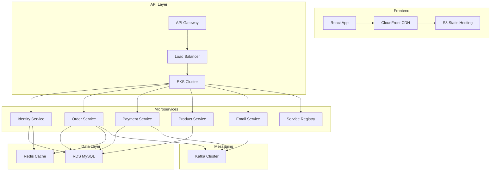

# 🚀 SpringBoot Kafka AWS Deployment - Guide d'apprentissage

## 📋 Vue d'ensemble

Ce repository est votre environnement d'apprentissage pour maîtriser le déploiement d'applications microservices sur AWS. Vous allez apprendre à :

- 🏗️ **Déployer des microservices** Spring Boot sur AWS EKS
- 📦 **Gérer les containers** avec Docker et ECR
- ☁️ **Utiliser les services AWS** (EKS, S3, CloudFront, RDS, etc.)
- 🔄 **Automatiser avec CI/CD** GitHub Actions
- 📊 **Monitorer et observer** vos applications
- 🛡️ **Sécuriser** votre infrastructure

## 🎯 Objectifs d'apprentissage

### Phase 1 : Infrastructure de base
- [x] Terraform pour Infrastructure as Code
- [x] AWS VPC, Subnets, Security Groups
- [x] Amazon EKS cluster configuration
- [x] RDS MySQL pour les données
- [x] ElastiCache Redis pour le cache

### Phase 2 : Application et services
- [x] 7 microservices Spring Boot
- [x] Apache Kafka pour messaging
- [x] Service Registry (Eureka)
- [x] API Gateway avec load balancing
- [x] Frontend React avec S3 + CloudFront

### Phase 3 : CI/CD et automatisation
- [x] GitHub Actions pipelines
- [x] Docker image builds vers ECR
- [x] Deployment automatisé avec Ansible
- [x] Tests et security scanning

### Phase 4 : Monitoring et production
- [ ] Prometheus + Grafana monitoring
- [ ] ELK Stack pour les logs
- [ ] Alerting et notifications
- [ ] Backup et disaster recovery

## 🏗️ Architecture apprise



## 📚 Compétences développées

### 🔧 Technologies AWS
- **EKS (Elastic Kubernetes Service)** : Orchestration des containers
- **ECR (Elastic Container Registry)** : Registry Docker privé
- **S3** : Stockage statique et backup
- **CloudFront** : CDN global
- **RDS** : Base de données managée
- **ElastiCache** : Cache Redis managé
- **VPC** : Réseau privé virtuel
- **ALB/NLB** : Load balancers

### 🛠️ Outils DevOps
- **Terraform** : Infrastructure as Code
- **Ansible** : Configuration management
- **Docker** : Containerisation
- **Kubernetes** : Orchestration
- **GitHub Actions** : CI/CD
- **Helm** : Package manager K8s

### 💻 Stack applicative
- **Spring Boot** : Framework Java
- **Apache Kafka** : Event streaming
- **React** : Frontend moderne
- **MySQL** : Base de données relationnelle
- **Redis** : Cache en mémoire
- **Nginx** : Reverse proxy

## 🚀 Guide de démarrage

### 1. Prérequis
```bash
# Outils requis
- AWS CLI configuré
- kubectl installé
- Terraform >= 1.5
- Docker
- Node.js 18+
- Java 17+
- Git
```

### 2. Configuration initiale
```bash
# Cloner le repository
git clone git@github.com:otniel-tamini/springboot-kafka-aws-deployment.git
cd springboot-kafka-aws-deployment

# Configurer AWS
aws configure
# Entrer : Access Key, Secret Key, Region (eu-west-1), Format (json)

# Configurer les pipelines CI/CD
cd .github
./setup-ci-cd.sh
```

### 3. Déploiement de l'infrastructure
```bash
# Infrastructure de base
cd terraform/environments/dev
terraform init
terraform plan
terraform apply

# Vérifier le cluster EKS
aws eks update-kubeconfig --region eu-west-1 --name ecommerce-dev-cluster
kubectl get nodes
```

### 4. Déploiement des applications
```bash
# Build et push des images
git add .
git commit -m "Initial deployment"
git push origin main
# → Déclenche automatiquement les pipelines CI/CD

# Déployer sur Kubernetes
cd ../../playbooks
ansible-playbook deploy-microservices.yml -e environment=dev
```

## 📖 Parcours d'apprentissage suggéré

### Semaine 1 : Infrastructure AWS
1. **Jour 1-2** : Comprendre Terraform et créer VPC
2. **Jour 3-4** : Déployer EKS cluster
3. **Jour 5-7** : Configurer RDS et ElastiCache

### Semaine 2 : Applications et services
1. **Jour 8-10** : Comprendre les microservices Spring Boot
2. **Jour 11-12** : Configurer Kafka et messaging
3. **Jour 13-14** : Déployer et tester les services

### Semaine 3 : Frontend et CI/CD
1. **Jour 15-16** : Déployer frontend React sur S3/CloudFront
2. **Jour 17-19** : Configurer pipelines GitHub Actions
3. **Jour 20-21** : Automatiser les déploiements

### Semaine 4 : Production et monitoring
1. **Jour 22-23** : Configurer monitoring (Prometheus/Grafana)
2. **Jour 24-25** : Logging avec ELK Stack
3. **Jour 26-28** : Sécurité et best practices

## 🎯 Exercices pratiques

### 🏃‍♂️ Exercice 1 : Premier déploiement
**Objectif** : Déployer l'infrastructure de base
```bash
# 1. Modifier terraform/environments/dev/terraform.tfvars
# 2. Déployer avec terraform apply
# 3. Vérifier les ressources créées dans AWS Console
# 4. Documenter les services créés
```

### 🏃‍♂️ Exercice 2 : CI/CD Pipeline
**Objectif** : Automatiser le build et déploiement
```bash
# 1. Configurer les secrets GitHub
# 2. Modifier un microservice
# 3. Pousser et observer le pipeline
# 4. Vérifier l'image dans ECR
```

### 🏃‍♂️ Exercice 3 : Scaling et performance
**Objectif** : Tester la scalabilité
```bash
# 1. Augmenter le nombre de replicas
# 2. Tester la charge avec des outils
# 3. Observer les métriques
# 4. Optimiser les ressources
```

## 📊 Métriques de progression

### ✅ Checkpoints de validation

#### Infrastructure (25%)
- [ ] VPC et subnets créés
- [ ] EKS cluster fonctionnel  
- [ ] RDS accessible depuis EKS
- [ ] Load balancers configurés

#### Applications (25%)
- [ ] 7 microservices déployés
- [ ] Kafka cluster opérationnel
- [ ] Inter-service communication
- [ ] Base de données peuplée

#### Frontend (25%)
- [ ] React app déployée sur S3
- [ ] CloudFront distribution active
- [ ] API accessible via frontend
- [ ] Formulaires fonctionnels

#### DevOps (25%)
- [ ] Pipelines CI/CD actifs
- [ ] Images auto-build vers ECR
- [ ] Déploiements automatisés
- [ ] Monitoring basique

## 🛠️ Troubleshooting courant

### 🔧 Problèmes infrastructure
```bash
# EKS nodes not ready
kubectl get nodes
kubectl describe node <node-name>

# RDS connection issues
kubectl exec -it <pod> -- mysql -h <rds-endpoint> -u <user> -p

# LoadBalancer pending
kubectl get svc
kubectl describe svc <service-name>
```

### 🔧 Problèmes application
```bash
# Pod en erreur
kubectl get pods
kubectl logs <pod-name>
kubectl describe pod <pod-name>

# Service discovery issues
kubectl get svc
kubectl get endpoints
```

### 🔧 Problèmes CI/CD
```bash
# GitHub Actions failing
# → Vérifier secrets et variables
# → Consulter logs détaillés
# → Vérifier permissions AWS

# ECR push failed
aws ecr get-login-password --region eu-west-1
docker login <ecr-url>
```

## 📈 Ressources d'apprentissage

### 📚 Documentation officielle
- [AWS EKS Documentation](https://docs.aws.amazon.com/eks/)
- [Terraform AWS Provider](https://registry.terraform.io/providers/hashicorp/aws/)
- [Kubernetes Documentation](https://kubernetes.io/docs/)
- [Spring Boot Guides](https://spring.io/guides)

### 🎥 Tutoriels recommandés
- AWS EKS Workshop
- Terraform AWS Examples
- Spring Boot Microservices
- Kubernetes Best Practices

### 🏆 Certifications ciblées
- **AWS Certified Solutions Architect**
- **AWS Certified DevOps Engineer**
- **Certified Kubernetes Administrator (CKA)**
- **Terraform Associate**

## 🎉 Prochaines étapes

Une fois ce projet maîtrisé, vous pourrez :

1. **Ajouter des services** : Notification, Analytics, Search
2. **Améliorer la sécurité** : WAF, Network Policies, Secrets Management
3. **Optimiser les coûts** : Spot instances, Auto-scaling, Reserved capacity
4. **Implémenter GitOps** : ArgoCD, Flux pour déploiements
5. **Service Mesh** : Istio pour traffic management avancé

## 📞 Support

Pour toute question sur votre apprentissage :
- 📝 Créer une issue GitHub
- 💬 Documentation dans `/docs`
- 🔍 Logs disponibles dans CloudWatch
- 📊 Métriques dans AWS Console

---

**Bonne chance dans votre apprentissage du déploiement AWS ! 🚀**

> 💡 **Conseil** : Prenez le temps de comprendre chaque étape avant de passer à la suivante. L'infrastructure AWS peut sembler complexe au début, mais devient intuitive avec la pratique.
